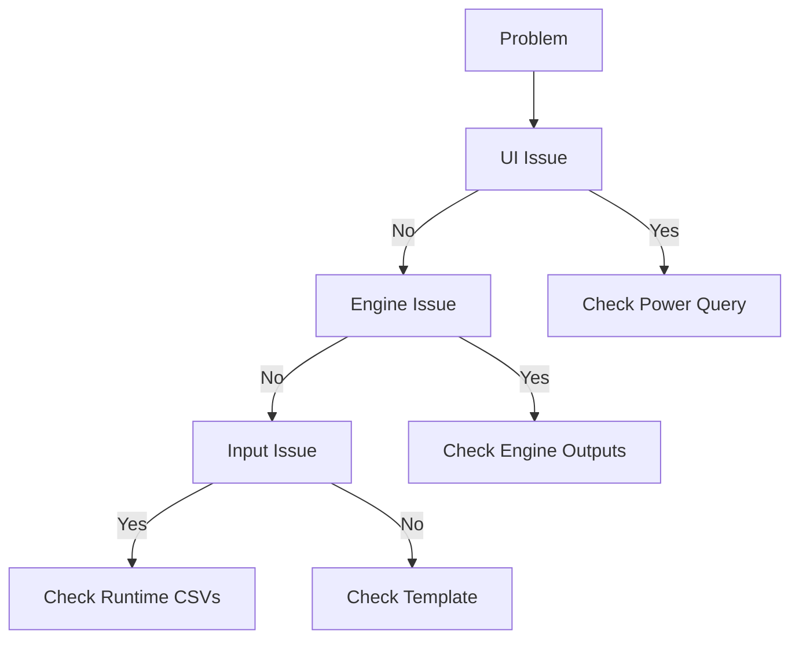
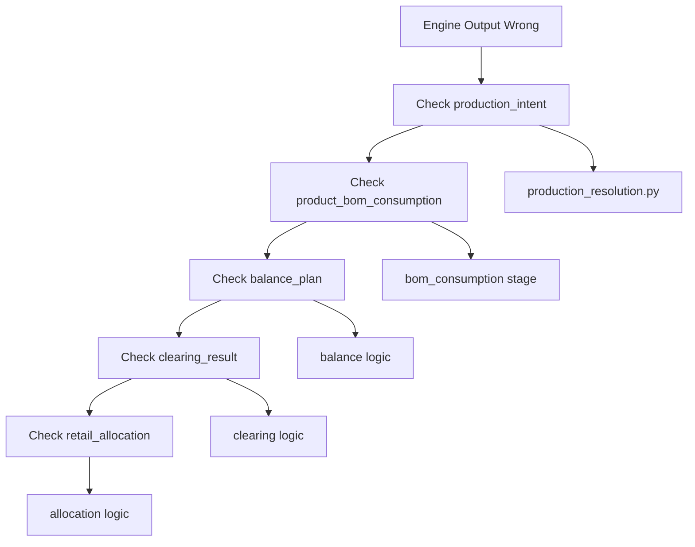
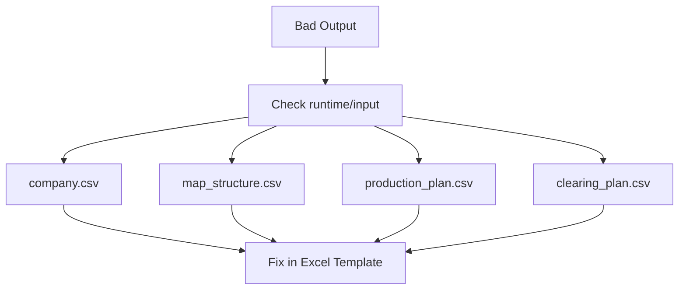
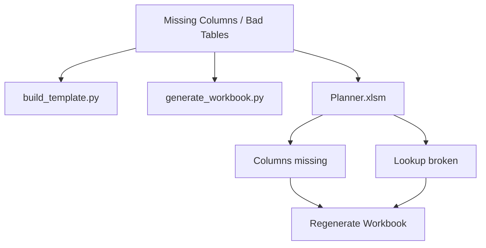
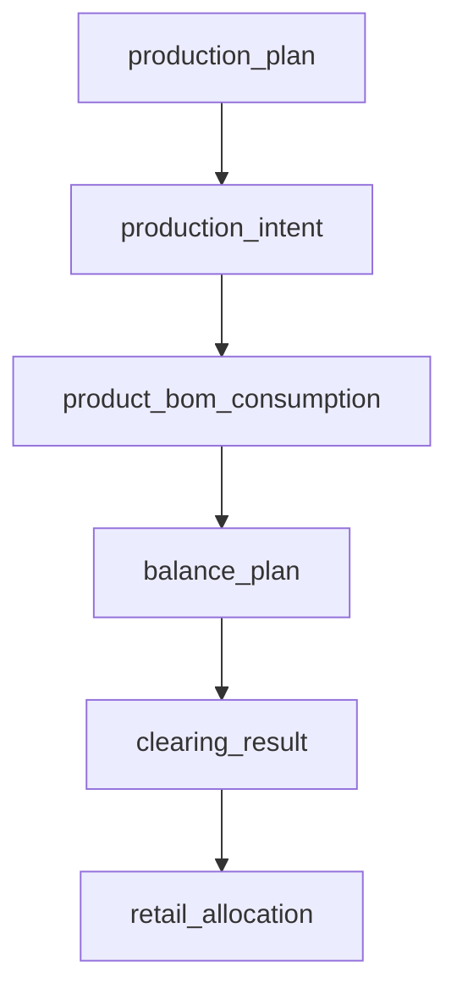
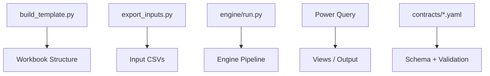

# Top-Level Debug FLow

```mermaid
flowchart TD

A["Problem"]
B["UI Issue"]
C["Engine Issue"]
D["Input Issue"]
E["Template Issue"]

A --> B
B -->|Yes| UI
B -->|No| C
C -->|Yes| ENG
C -->|No| D
D -->|Yes| IN
D -->|No| E

UI["Check Power Query"]
ENG["Check Engine Outputs"]
IN["Check Runtime CSVs"]
E["Check Template"]
```

## Engine Debug Flow

```mermaid
flowchart TD

A["Engine Output Wrong"]

A --> B["Check production_intent"]
B --> C["Check product_bom_consumption"]
C --> D["Check balance_plan"]
D --> E["Check clearing_result"]
E --> F["Check retail_allocation"]

B --> B1["production_resolution.py"]
C --> C1["bom_consumption stage"]
D --> D1["balance logic"]
E --> E1["clearing logic"]
F --> F1["allocation logic"]
```

## Input Debug Flow

```mermaid
flowchart TD

A["Bad Output"]

A --> B["Check runtime/input"]

B --> C["company.csv"]
B --> D["map_structure.csv"]
B --> E["production_plan.csv"]
B --> F["clearing_plan.csv"]

C --> FIX["Fix in Excel Template"]
D --> FIX
E --> FIX
F --> FIX
```

## Template Debug Flow

```mermaid
flowchart TD

A["Missing Columns / Bad Tables"]

A --> B["build_template.py"]
A --> C["generate_workbook.py"]
A --> D["Planner.xlsm"]

D --> E["Columns missing"]
D --> F["Lookup broken"]

E --> FIX["Regenerate Workbook"]
F --> FIX
```

## Data Lineage Map

```mermaid
flowchart TD

A["production_plan"]
B["production_intent"]
C["product_bom_consumption"]
D["balance_plan"]
E["clearing_result"]
F["retail_allocation"]

A --> B
B --> C
C --> D
D --> E
E --> F
```

## File Ownership Map

```mermaid
flowchart TD

A["build_template.py"] --> T["Workbook Structure"]

B["export_inputs.py"] --> IN["Input CSVs"]

C["engine/run.py"] --> ENG["Engine Pipeline"]

D["Power Query"] --> UI["Views / Output"]

E["contracts/*.yaml"] --> SCHEMA["Schema + Validation"]
```