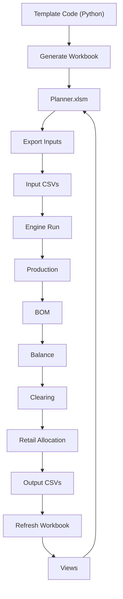
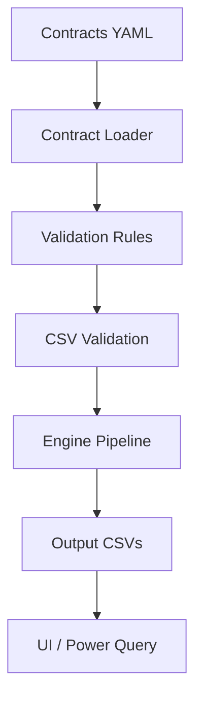
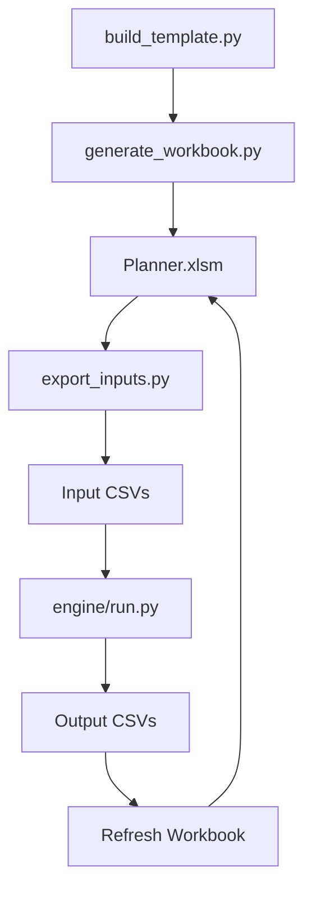
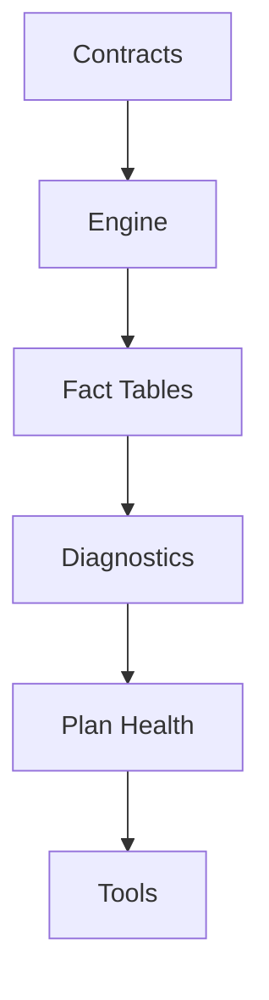

## Engine Pipeline

```mermaid
flowchart TD

A["Template Code (Python)"]
B["Generate Workbook"]
C["Planner.xlsm"]

D["Export Inputs"]
E["Input CSVs"]

F["Engine Run"]
G1["Production"]
G2["BOM"]
G3["Balance"]
G4["Clearing"]
G5["Retail Allocation"]

H["Output CSVs"]

I["Refresh Workbook"]
J["Views"]

A --> B
B --> C
C --> D
D --> E
E --> F
F --> G1
G1 --> G2
G2 --> G3
G3 --> G4
G4 --> G5
G5 --> H
H --> I
I --> J
J --> C
```

## Contract System

```mermaid
flowchart TD

A["Contracts YAML"]
B["Contract Loader"]
C["Validation Rules"]
D["CSV Validation"]
E["Engine Pipeline"]
F["Output CSVs"]
G["UI / Power Query"]

A --> B
B --> C
C --> D
D --> E
E --> F
F --> G
```

## Developer Workflow

```mermaid
flowchart TD

A["build_template.py"]
B["generate_workbook.py"]
C["Planner.xlsm"]

D["export_inputs.py"]
E["Input CSVs"]

F["engine/run.py"]
G["Output CSVs"]

H["Refresh Workbook"]

A --> B
B --> C
C --> D
D --> E
E --> F
F --> G
G --> H
H --> C
```

## Conceptual Layers

```mermaid
flowchart TD

A["Contracts"]
B["Engine"]
C["Fact Tables"]
D["Diagnostics"]
E["Plan Health"]
F["Tools"]

A --> B
B --> C
C --> D
D --> E
E --> F
```